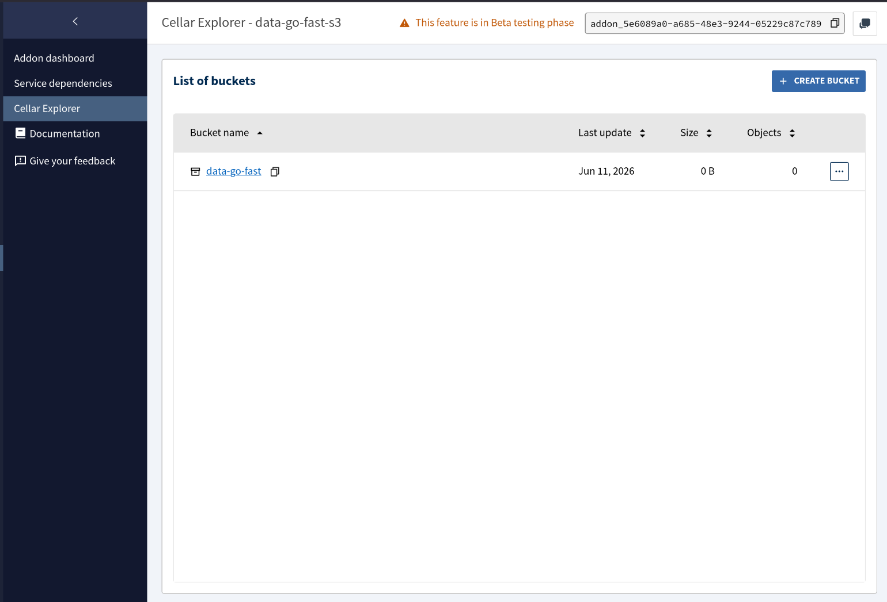

# Apps

You can follow this tutorial step by step or run the `set-up.sh`script to generate the ressources automatically.
Please note that you will still need to initialise your tables in the database and create an S3 bucket.

## Unified Backend (Server + Worker)

The backend is deployed as a single Clever Cloud **Rust** application. This application contains two binaries: the `server` (web process) and the `worker` (background job processor).

### 1. Create the Backend App

```bash
clever create --type rust data-go-fast-backend --alias backend --org orga_e4d64185-94d8-4d10-9d26-31b39dafd743
```

### 2. Configure the Processes

Clever Cloud will build your Cargo workspace. You need to tell it which binary to run for the web process and add a "Worker" for the background process.

**Set the main server command:**
```bash
clever env set CC_RUN_COMMAND "./target/release/server" --alias backend
clever env set SERVER_PORT 8080 --alias backend
```

**Add the background worker:**
```bash
clever env set CC_WORKER_COMMAND "./target/release/worker" --alias backend
```

### 3. Link Addons & Map Variables

Link all necessary services to the `backend` alias.

#### PostgreSQL
```bash
clever service link-addon data-go-fast-db --alias backend
clever env set DATABASE_URL 'postgres://${POSTGRESQL_ADDON_USER}:${POSTGRESQL_ADDON_PASSWORD}@${POSTGRESQL_ADDON_HOST}:${POSTGRESQL_ADDON_PORT}/${POSTGRESQL_ADDON_DB}' --alias backend
```

Make sure to initialise your tables in the database :
```bash
cat init.sql | psql -h ${POSTGRES_ADDON_HOST} -p ${POSTGRES_ADDON_PORT} -U ${POSTGRES_ADDON_USER} -d ${POSTGRES_ADDON_DB}
```

#### Redis (Queue)
```bash
clever service link-addon data-go-fast-redis --alias backend
clever env set REDIS_CONNECTION_STRING 'redis://default:${REDIS_ADDON_PASSWORD}@${REDIS_ADDON_HOST}:${REDIS_ADDON_PORT}/' --alias backend
```

#### S3 (Cellar)
```bash
clever service link-addon data-go-fast-s3 --alias backend
clever env set S3_ENDPOINT 'https://${CELLAR_ADDON_HOST}' --alias backend
clever env set AWS_ACCESS_KEY_ID '${CELLAR_ADDON_KEY_ID}' --alias backend
clever env set AWS_SECRET_ACCESS_KEY '${CELLAR_ADDON_KEY_SECRET}' --alias backend
clever env set AWS_DEFAULT_REGION "garage" --alias backend
clever env set BUCKET_NAME "data-go-fast" --alias backend
```

Make sure to create a bucket called "data-go-fast" in your cellar addon.



#### Security
```bash
clever env set JWT_SECRET "your_secure_secret" --alias backend
```

---

## Frontend (Static/Vite)

The frontend is a separate **Docker** application.

### 1. Create the Frontend App

```bash
clever create --type docker data-go-fast-front --alias front --org orga_e4d64185-94d8-4d10-9d26-31b39dafd743
```

### 2. Configure Docker Path

```bash
clever env set CC_DOCKERFILE "front/Dockerfile" --alias front
```

### 3. Set Environment Variables

```bash
# Point the frontend to your unified backend domain
clever env set BACKEND_URL "https://<your-backend-domain>.cleverapps.io" --alias front
```

---

## Deployment & Scaling

### Scaling for Rust Builds
Rust builds are resource-intensive. Ensure the backend has at least an **S** flavor during build.

```bash
clever scale --flavor S --alias backend
```

### Deploying

```bash
clever deploy --alias backend
clever deploy --alias front
```

## Useful Commands

### Restart
```bash
clever restart --alias backend
```

### Logs
```bash
clever log --alias backend
```
